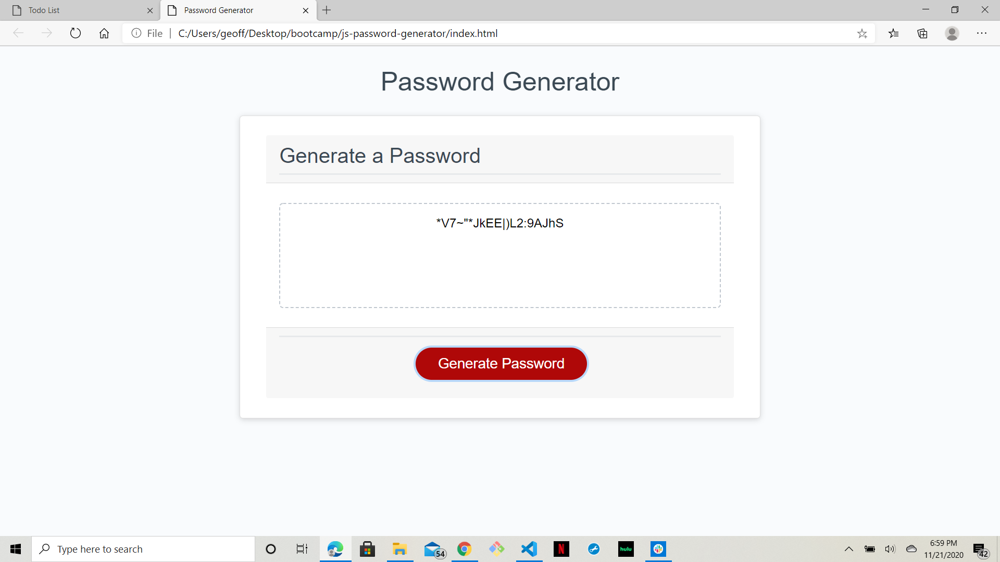

# JavaScript Based Password Generator
----

## Goals:

The purpous behind this application is to provide the client with a means to produce a dependably and significantly randomized password that is set to their given requirements. The following page is presented for the user interface: 

## User Story:

When the user clicks on the "Generate Password" button, the will be presented with a series of prompt in which they will:
1. Choose the length of the password in number of characters.
1. Choose whether to include:
    1. Special characters
    1. Uppercase letters
    1. Lowercase letters
    1. Numbers

At each of these choices the user is then notified with an alert as to what characters they have or have not chosen. The application then displays a randomized password with the criteria they have chosen in the dialogue box in the center of the screen.

[This is a link to the page](https://geoff7709.github.io/js-password-generator/)

## Application
In a world where security is an ever-developing concern, passwords are the first line of defense. In providing an application that can provide a rondomized password of up to 128 characters pulled from a pool of ninety-two possibilities, we have given the user a robust tool. With the sample and objects chosen, there are something like 8 * 10e30 possible combinations of numbers and letters. This seems to be a good start on the road to a secure password.

